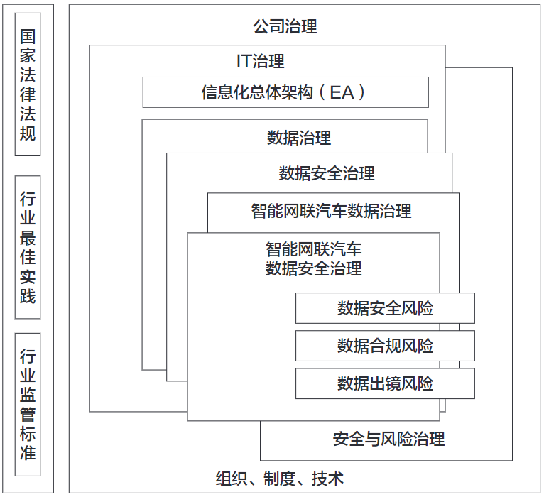

# 智能网联汽车数据安全治理框架研究

## 文章信息

### 作&emsp;&emsp;者：曾小松

### 单&emsp;&emsp;位：工业和信息化部装备工业发展中心

### 发表时间：2022-05

### 来&emsp;&emsp;源：《智能网联汽车》

### 引用格式：[1]曾小松.[智能网联汽车数据安全治理框架研究](https://kns.cnki.net/kcms/detail/detail.aspx?dbcode=CJFD&dbname=CJFDAUTO&filename=ZNWL202203006)(J).智能网联汽车,2022(03):22-26

---

## 文章摘要

快速发展的智能网联汽车市场使得数据安全形势与挑战日益严峻，**数据安全**已经成为车辆生产企业的核心竞争力之一，智能网联汽车数据安全治理工作的重要性日益凸显。本文对国内外的数据安全治理框架进行了简单介绍，从**行业、企业**两个层面对智能网联汽车数据安全治理框架进行了初步探索，提出了一种“元框架”设想。

## 文章内容摘抄

### 1. 智能网联汽车数据安全概况

#### 1.1 智能网联汽车数据安全概况

* 全球市场**搭载智能网联功能的新车渗透率**约为45%，预计至2025年可达到60%左右，中国则有望超过75%。
* 国际数据公司IDC预测，2035年中国智能网联汽车**产业规模**将超过2000亿美元。
* **数据安全风险方面**，汽车网络安全公司Upstream Security发布的2020年《汽车网络安全报告》显示，自2016年至2020年1月，[汽车网络安全事件增长了605%，仅2019年一年就增长1倍以上](https://www.helpnetsecurity.com/2020/01/06/automotive-cybersecurity-incidents/)。
* 工信部车联网动态监测情况显示，2020年针对我国整车企业、车联网信息服务提供商等相关企业和平台的**恶意攻击**已达到280余万次。
* 2020年，国家市场监管总局缺陷产品管理中心联合相关机构，针对多款智能网联汽车进行**信息安全测试**，结果发现高达63%的车辆存在一定程度的信息安全隐患。

#### 1.2 数据安全已成为车企核心竞争力之一

* J.D.Power(君迪)公司调查表明，超过九成(94.6%)的消费者会有倾向性地选择注重数据安全和保护个人敏感信息的汽车品牌，这其中，54.6%的消费者表示"一定会"购买数据安全保障能力强的品牌。

### 2. 数据安全治理框架概况

#### 2.1 国外数据安全治理框架简介

##### 微软 DGPC

* DGPC：以隐私、保密和合规为目标的整体化数据治理方法
* DGPC主要从**方法论层面**为数据安全治理提供参考，缺少对数据全生命周期各环节落实数据安全治理措施的具体指导。

##### Gartner DSG

* 2017年，Gartner在安全与风险管理峰会上发表《2017年数据安全态势》，提出了**数据安全治理**

#### 2.2 国内数据安全治理框架简介

* 中关村网络安全与信息化产业联盟数据安全治理专业委员会发布的**《数据安全治理白皮书》**（2021年5月发布了3.0版）
* 中国软件评测中心联合国家信息中心以及蚂蚁科技集团股份有限公司在2021年12月共同发布的**《数据安全复合治理与实践白皮书》**
* 全国信息安全标准化技术委员会在2019年8月发布的**《信息安全技术数据安全能力成熟度模型》**（GB/T 37988-2019）提出的数据安全能力成熟度模型（DSMM, Data Security Maturity Model），为数据安全治理提供非常有价值的参考
* 国内外各种数据安全治理框架具有很多共同性，基本都以不同形式体现了对**组织、制度、技术**三个维度的要求

### 3. 智能网联汽车数据安全治理框架初探

#### 3.1 行业层面的数据安全治理框架

* 行业组织方面，中国汽车行业协会组织编制的**《智能网联汽车数据安全评估指南》**团体标准于2022年3月9日公开征求意见

#### 3.2 企业层面的数据安全治理框架

* 笔者提出一种"智能网联汽车数据安全治理元框架"设想（后简称"元框架"）

*智能网联汽车数据安全治理元框架*
