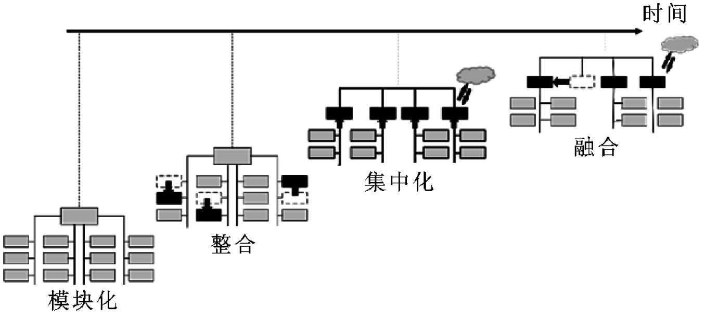
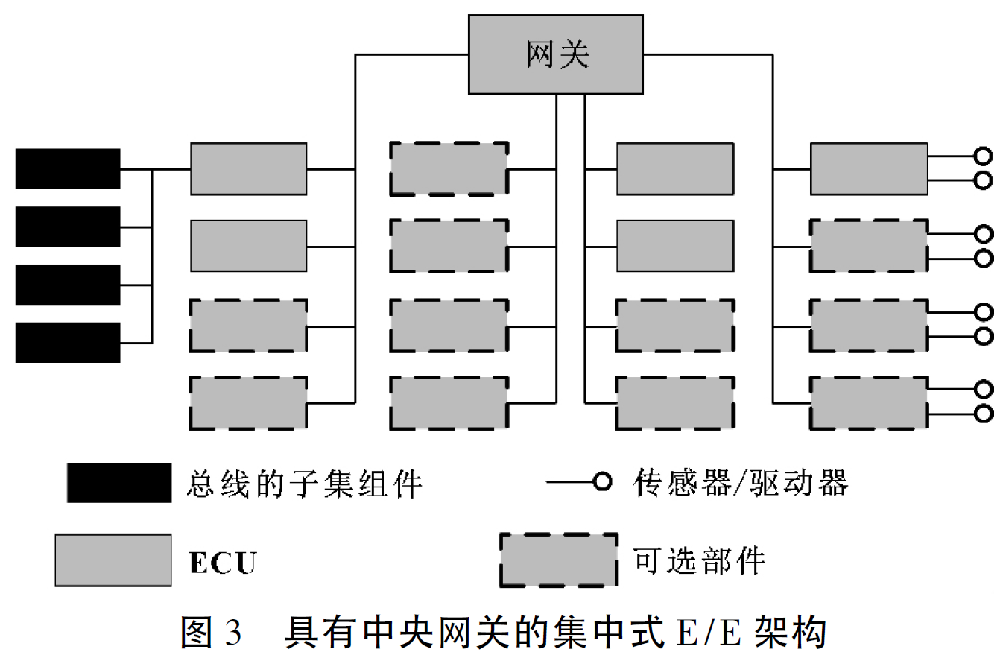
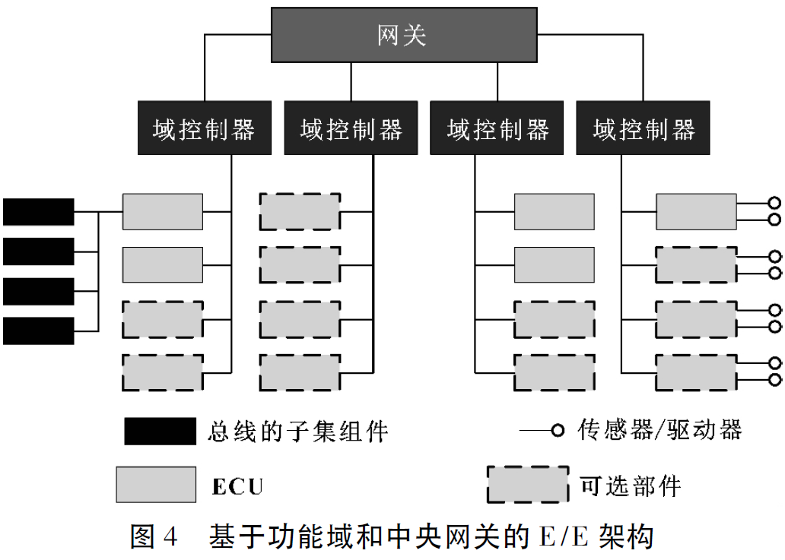
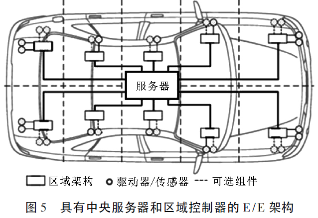
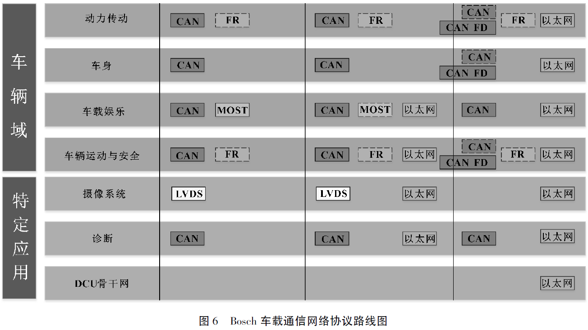

# 基于模型的智能汽车电子电气架构发展综述

## 文章信息

### 作&emsp;&emsp;者：华一丁

### 单&emsp;&emsp;位：天津大学

### 发表时间：2019-02

### 来&emsp;&emsp;源：《汽车零部件》

### 引用格式：[1]华一丁,龚进峰,戎辉,唐风敏,王文扬,何佳.[基于模型的智能汽车电子电气架构发展综述](https://kns.cnki.net/kcms/detail/detail.aspx?dbcode=CJFD&dbname=CJFDLAST2019&filename=QCLJ201902026)[J].汽车零部件,2019(02):63-66.DOI:10.19466/j.cnki.1674-1986.2019.02.016.

---

## 文章摘要

智能汽车的发展为基于模型的电子电气架构提出了新的要求,如通信带宽、实时性、域控制器的设计、架构可延展性等。综述了**汽车的域控制器、电子电气（E/E）架构模型的演变历程和车载通信网络技术现状**,认为基于**域控制器和车载以太网的E/E架构**会是适应于智能驾驶时代的汽车电子电气架构。

## 文章内容摘抄

### 引言

* 电子控制单元(Electronic Control Unit，ECU)集成和功能化的趋势使得其实现域控制，在E/E框架演变的过程中，从模块方法转变成更加集成化的方法，实现ECU和域的融合。

* 近年来，**自动驾驶**所带来车辆结构的改变，使得许多传感器和电子控制单元被添加到当前的车辆架构中，并需要**进一步提高其可靠性、安全性和可扩展性**等要求。而汽车的电子电气架构也随之带来改变。

### 域控制器

* 汽车电子一般分为**动力总成域、底盘域、车身域与多媒体域**。

* 为了实现**高度自动化的驾驶功能**，智能驾驶对域内的ECU之间也提出了**更多的交互要求**。

* **未来不同域之间的联系也会更加紧密**。NAVALE等提出驾驶辅助域会成为传感器和底盘域中嵌入功能之间的联系，底盘域和动力总成域会融合成为车辆运动控制域，这样的架构会**很大程度简化高度自动驾驶的实现过程**。

### 电子电气架构模型的演变

*电子电气架构模型演变示意图*

* 在发展初期，每个模块都有单独的ECU，随着ECU的合并以及软硬件的集成，促进了架构模型从单元模块到更加集成化模块的发展，并逐步实现了ECU和域的融合。

* 随着智能网联技术的愈发成熟，使用云端处理器来集中处理车辆也逐渐成为可能。

* **车辆个体复杂程度的增加、互联通信的普及**，对于通信带宽、通信速度、计算能力以及电子电气架构的可延展性都提出了更高的要求。

* **实时性需求、诊断服务请求、总线负载限制、安全与加密需求等整车功能导向目标**都是在设计E/E框架时需要考虑的。

* 当前E/E架构的典型特征是将整个体系结构分为不同的域，每个域对一部分ECU进行整合，这些ECU通过共享总线系统进行通信，中央网关将不同网络的域相互连接，并使不同领域的ECU能够进行通信

*ECU内部通信及ECU网关通信都处于同一线路上，使得网关的通信负载很高*

* 一种基于功能域的架构(Domain Based Architecture)实现了网关的简化。

*ECU按其功能分组并连接到域控制器，这些域控制器通过中央网关连接*

* 实现网关简化的一种方法是**将组件集成到功能域中，为每个域集成高性能控制器**。这种结构由于大部分数据交换发生在功能域内，**减少了ECU内部来自网关的通信**。这种架构的网关复杂程度降低，带来了更好的架构可伸缩性。

* 自动驾驶中车辆功能的重叠增加，通信增多，网关负载会增大。

*为了避免这种情况，Brunner等提出了区域架构(Zone Architecture)*

* 除了功能域集群之外，还可以根据部件在车辆中的物理位置组成来进行整合。类似于上文中的功能域架构，车辆被分为几个区域，每个区域有一个区域控制器，区域控制器只实现转发而不进行处理，在服务器中完成处理。该方法可降低布线成本约20%。

### 车载通信网络

* **自动驾驶的发展**以及**车载信息娱乐系统的不断升级**将推动车载通信网络架构及协议的变化

* 车载以太网在**带宽需求、开放性和可扩展性、物理层传输介质成本以及技术成熟性和标准化方面**都有明显优势

*车辆中所划分的不同域根据不同的网络需求逐步转向新的协议*

### 结束语

* 由于**高速高带宽的通信要求**逐步引入了以太网在车载通信网络中的应用，**越来越繁复的传感器和执行器构件**也为**车辆域的划分和域控制器的设计带来新的挑战**，同时**中央网关及高性能处理器等软硬件设备的进步**也为智能网联汽车的E/E架构带来**新的动力**。
