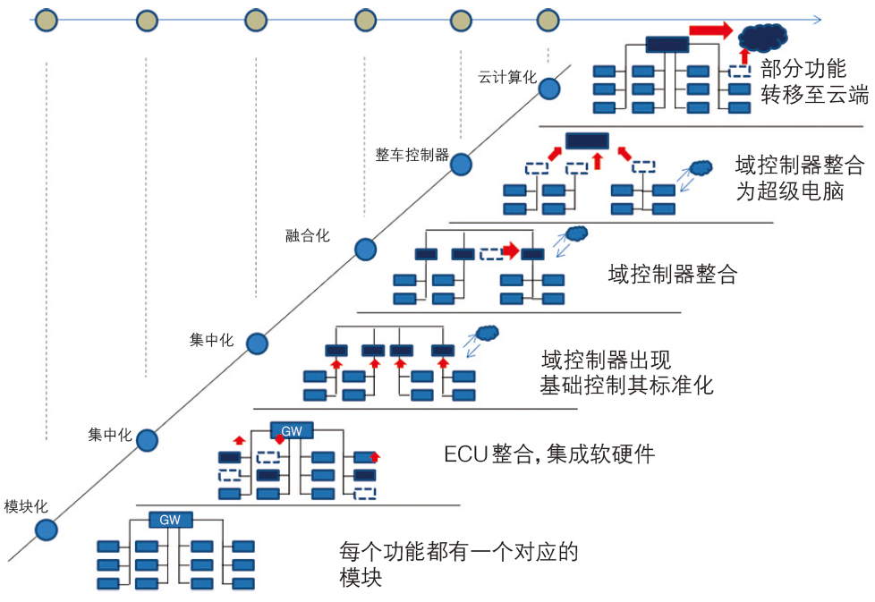
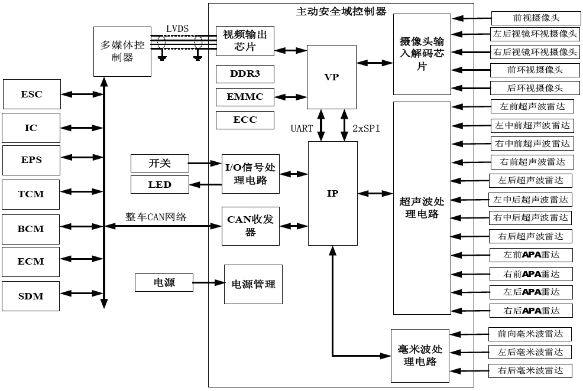

# 浅析汽车电子架构发展与典型域控制器

## 文章信息

### 作&emsp;&emsp;者：黎伟

### 单&emsp;&emsp;位：上汽通用五菱汽车股份有限公司

### 发表时间：2021-08

### 来&emsp;&emsp;源：《汽车零部件》

### 引用格式：[1]黎伟,俞晓勇,匡小军.[浅析汽车电子架构发展与典型域控制器](https://kns.cnki.net/kcms/detail/detail.aspx?dbcode=CJFD&dbname=CJFDLAST2021&filename=SDQE202116075)[J].时代汽车,2021(16):163-164.

---

## 文章摘要

本论文从电子电气发展历程、电子电气发展趋势、电子电气架构开发以及典型的域控制器几个方面剖析目前汽车架构发展方向。

## 文章内容摘抄

### 电子电气发展历程

#### 日益增加的功能需求

* 从1990年到2020年，**汽车功能迅猛发展，以10年一个跨度爆炸式增长**：90年初汽车仅仅是拥有一些常用的被动安全性功能，集成了一些常用的安全性质的模块例如：ABS、EPS、安全气囊等；到2000年前后汽车已经拥有了导航、巡航、胎压监测等功能；2010年前后远程启动、高阶自适应巡航、电子刹车功能被应用于汽车之上；到如今语音控制、自动驾驶成为研发主流。

#### 汽车电子电气系统发展及设计挑战

* 对比汽车架构演变趋势，低端的汽车架构**不足之处**在于:
  * 效率低下
  * 维护困难
  * 低复用性

### 简易电子电气架构开发

#### 电子电气架构开发的意义

* 成熟的架构有助于**平衡多个开发目标**（成本、重量、质量等）、可以建立**成熟可靠**的电子电气平台、拥有强大的**沿用性与可拓展性**。

#### 简易的电子电气架构开发分类

* 物理架构设计
* 网络架构设计
* 功能架构设计

#### 简易的汽车电子架构开发流程

分为四部分。分别为：

* 需求开发
  * 对标车型分析
  * 市场需求分析
  * 客户需求分析
  * 产品特性分析
* 架构开发
  * 功能方案开发
  * 逻辑架构模型开发
  * 物理架构开发
  * 网络架构开发
* 系统开发
  * 系统功能规范
  * 电器系统开发
  * 系统架构评审
* 系统验证（重点验证）
  * CAN&LIN总线测试
  * 诊断测试
  * 整车静态测试
  * 整车路试测试

### 电子架构要求下的简易域融合控制器

* 架构发展初期，智能驾驶的功能依托于多个**主动安全相关控制器**来实现

* 随着汽车电子架构发展，功能域的概念进入大众视野，主动安全的相关功能最终会融合落地于一个大型的域控制器

* 进行域控制器融合后，能有效缩小总零件体积、减小总布置难度、降低整车线束、网络信号复杂程度、同时域控制器有益于整车轻量化，能够提高整车质量，方便后续故障定位以及整车维修

